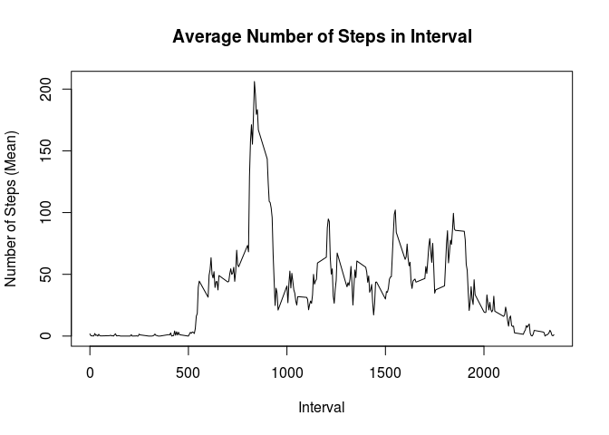

## Loading and preprocessing the data

```r
unzip(zipfile="activity.zip")
data <- read.csv("activity.csv")
head(data)
```

```
##   steps       date interval
## 1    NA 2012-10-01        0
## 2    NA 2012-10-01        5
## 3    NA 2012-10-01       10
## 4    NA 2012-10-01       15
## 5    NA 2012-10-01       20
## 6    NA 2012-10-01       25
```


## What is mean total number of steps taken per day?
1. Calculate the total number of steps taken per day

```r
stepsPerDay <- with(data, tapply(steps, date, sum, na.rm=TRUE))
```

2. Make a histogram of the total number of steps taken each day

```r
hist(stepsPerDay, col="blue", xlab="Total Daily Steps", 
     main="Histogram of Daily Total Steps")
```

<!-- -->

3. Calculate and report the mean and median of the total number of steps taken per day


```r
library(xtable)
xt <-xtable(data.frame(mean=mean(stepsPerDay), median=median(stepsPerDay),
                       row.names="total daily steps"), auto=TRUE)
print(xt, type="html")
```

<!-- html table generated in R 3.4.4 by xtable 1.8-2 package -->
<!-- Fri Jul 27 16:00:27 2018 -->
<table border=1>
<tr> <th>  </th> <th> mean </th> <th> median </th>  </tr>
  <tr> <td> total daily steps </td> <td align="right"> 9354.2295082 </td> <td align="right"> 10395 </td> </tr>
   </table>

## What is the average daily activity pattern?
1. Make a time series plot of the 5-minute interval (x-axis) and the average number of steps taken, averaged across all days (y-axis)

```r
meanPerInterval <- with(data, tapply(steps, interval, mean, na.rm=TRUE))
plot(x=names(meanPerInterval), y=meanPerInterval, type="l", xlab="Interval", ylab="Number of Steps (Mean", main="Average Number of Steps in Interval")
```

<!-- -->

2. Which 5-minute interval, on average across all the days in the dataset, contains the maximum number of steps?

```r
highest <- meanPerInterval[which.max(meanPerInterval)]
ind <- names(highest)
```

Maximum mean number of steps in interval: 206.1698113

Interval containing the maximum mean steps: 835

## Imputing missing values
1. Calculate and report the total number of missing values in the dataset (i.e. the total number of rows with \color{red}{\verb|NA|}NAs)

```r
missing <- sum(is.na(data$steps))
```

Total number of missing values in the dataset: 2304

2. Devise a strategy for filling in all of the missing values in the dataset. 

The chosen strategy is to fill the missing values with the rounded mean for that 5 minute interval.

```r
fill.na <- function(x, i) { 
    ifelse(is.na(x), round(meanPerInterval[as.character(i)]), x)
    }
imputed.steps <- mapply(fill.na, data$steps, data$interval)
```
3. Create a new dataset that is equal to the original dataset but with the missing data filled in.

```r
imputed <- data.frame(imputed.steps, data$date, data$interval)
colnames(imputed) <- colnames(data)
head(imputed)
```

```
##   steps       date interval
## 1     2 2012-10-01        0
## 2     0 2012-10-01        5
## 3     0 2012-10-01       10
## 4     0 2012-10-01       15
## 5     0 2012-10-01       20
## 6     2 2012-10-01       25
```
4. Make a histogram of the total number of steps taken each day.

```r
imputedTotal <- with(imputed, tapply(steps, date, sum, na.rm=TRUE))
hist(imputedTotal, col="blue", xlab="Total Daily Steps(imputed)", 
     main="Histogram of Daily Total Steps (Imputed)")
```

<!-- -->

5. Calculate and report the mean and median total number of steps taken per day. Do these values differ from the estimates from the first part of the assignment? What is the impact of imputing missing data on the estimates of the total daily number of steps?

```r
xt <-xtable(data.frame(mean=mean(imputedTotal), median=median(imputedTotal),
                       row.names="Imputed total daily steps"), auto=TRUE)
print(xt, type="html")
```

<!-- html table generated in R 3.4.4 by xtable 1.8-2 package -->
<!-- Fri Jul 27 16:00:28 2018 -->
<table border=1>
<tr> <th>  </th> <th> mean </th> <th> median </th>  </tr>
  <tr> <td> Imputed total daily steps </td> <td align="right"> 10765.6393443 </td> <td align="right"> 10762 </td> </tr>
   </table>

Both the mean and median values of the imputed dataset are higher than those of the original dataset. Since the value used to impute the missing value is the average for the interval across dates, it artificially increases the per day values, especially for dates with no data (i.e. sum 0 with NA removed ) in the original dataset.

## Are there differences in activity patterns between weekdays and weekends?
1. Create a new factor variable in the dataset with two levels – “weekday” and “weekend” indicating whether a given date is a weekday or weekend day.

```r
determine.day <- function(d) { 
    ifelse(weekdays(as.Date(d)) %in% c("Saturday", "Sunday"), 
           "weekend", "weekday")
    }
imputed$day <- sapply(imputed$date, determine.day)
head(imputed)
```

```
##   steps       date interval     day
## 1     2 2012-10-01        0 weekday
## 2     0 2012-10-01        5 weekday
## 3     0 2012-10-01       10 weekday
## 4     0 2012-10-01       15 weekday
## 5     0 2012-10-01       20 weekday
## 6     2 2012-10-01       25 weekday
```

2. Make a panel plot containing a time series plot (i.e. \color{red}{\verb|type = "l"|}type="l") of the 5-minute interval (x-axis) and the average number of steps taken, averaged across all weekday days or weekend days (y-axis).

```r
library(ggplot2)
g <- ggplot(imputed, aes(interval, steps))
g + stat_summary(fun.y=mean, geom="line") + facet_grid(day~.) + 
    ylab("average number of steps")
```

<!-- -->

